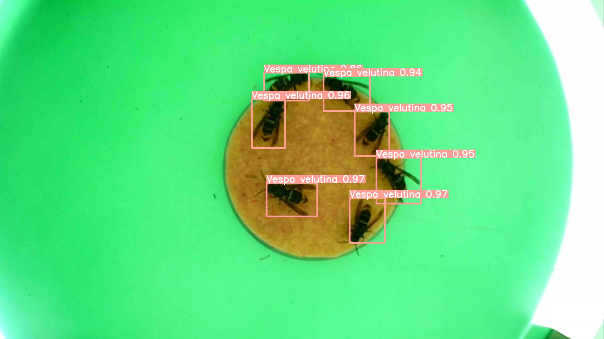

# VespAI

An object dectection and classification model to identify Asian hornets, *Vespa velutina nigrithorax*, and European hornets, *Vespa crabro*, from images collected at bait stations. This builds the basis for an early warning system to track the spread of the invasive hornet *Vespa velutina*.

## Contents
* [explanation](explanation) contains notebooks used for computing Layer-wise Relevance Propagation (LRP) heatmaps of trained model predictions.
* [formatting](formatting) contains notebooks & scripts used to generate YOLOv5-ready training/testing data from the raw **Plainsight** labelling outputs.
* [images](images) contains example graphics surrounding the project.
* [manuals](manuals) contains some documentation surrounding the Raspberry Pi implementation and usage.
* [models](models) contains notebooks for training YOLOv5s models
  - [yolov5-params](models/yolov5-params) contains trained weights over various datasets, as well as a bespoke augmentation file for the training scripts.
* [monitor](monitor) contains an implementation script [monitor_run.py](monitor_run.py) which imports YOLOv5 via [PyTorch Hub](https://pytorch.org/hub/ultralytics_yolov5/) and runs inference based on a webcam input. There are also varios pre-filtering stages base on the [ViBe](https://ieeexplore.ieee.org/document/5672785) background subtraction algorithm, which is also implemented in this folder.

## Detections

